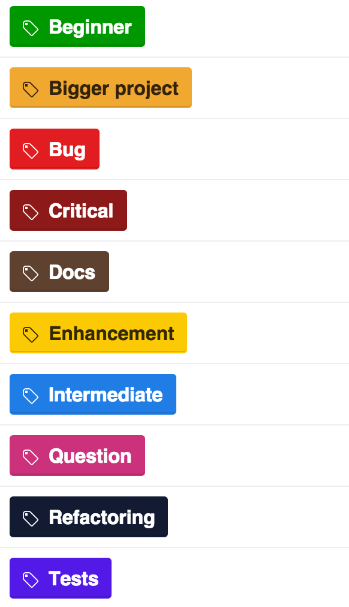

# GitHub Labels

<div style="text-align: left">
  
</div>

## Scope
A cli for managing GitHub labels.

## Getting Started

1. Install the Label Manager

with npm:
```
npm install @commercetools/github-labels --save-dev
```

2. Define the authentication token

  Generate a new GitHub [AUTH_TOKEN](https://github.com/settings/tokens) and write it into your **.env** file. The token should only need the `public_repo` scope (for public repositories) or `repo` (for private repositories).

```
AUTH_TOKEN="your-token"
```

3. Initialize the labels config

  If you don't have a labels config file yet, you can initialize one by running:
```
github-labels init
```

## Manage your labels
GitHub labels are managed through the labels config file. The config must be in JSON format and can be defined in the following files:
- `package.json`, under the name `github-labels`
- `.github-labelsrc`
- `.github-labelsrc.json`
If you don't have this file yet, follow the given instructions at [3. Create label config](#getting-started).
In this file, you can see all your current label data. If you want to change something on your labels,
just modify the file as you like. After modifying, save your changes and run the command below:
```
github-labels sync
```
This will synchronize the config file with your GitHub repository.
If you want to see your changes, just go to your label settings on GitHub to see your current labels.

### Config structure:
```
{
  "id": 1336719046,
  "name": "bug",
  "color": "8eedc7",
  "description": "Something isn't working"
}
```

### Required fields:
| Data | Required | Type |
|:-------- |:-------:| :-------|
| id | no | Id (Created by GitHub) |
| name | yes | String (Native emojis can be added) |
| color | no | String (hexadecimal color code without the leading #) |
| description | no | String |


### Reuse the same config across different repositories

If you have installed `github-labels` in your repository, yo can simply copy-paste the
`.github-labelsrc.json` file into your new repository. After that, remove the ids of each
label and synchronize them with GitHub:

```
github-labels sync
```